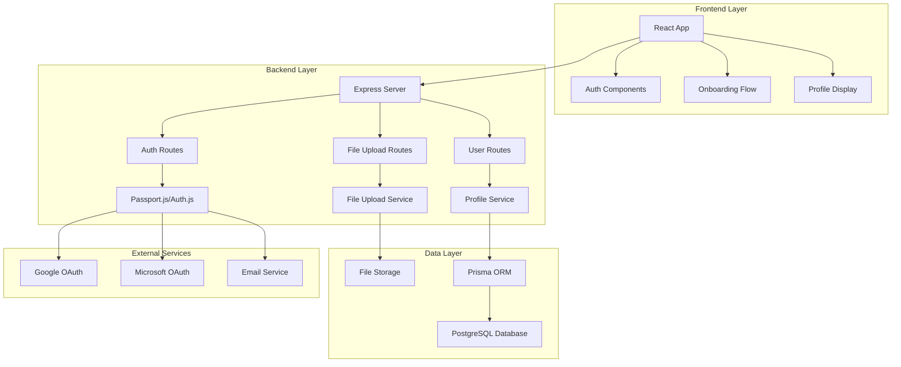
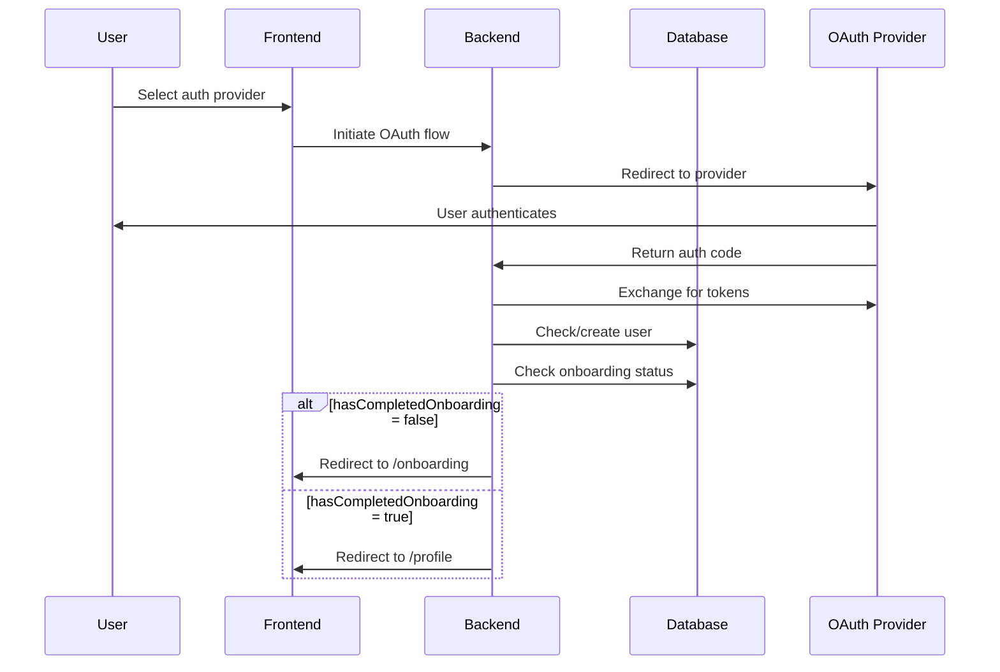
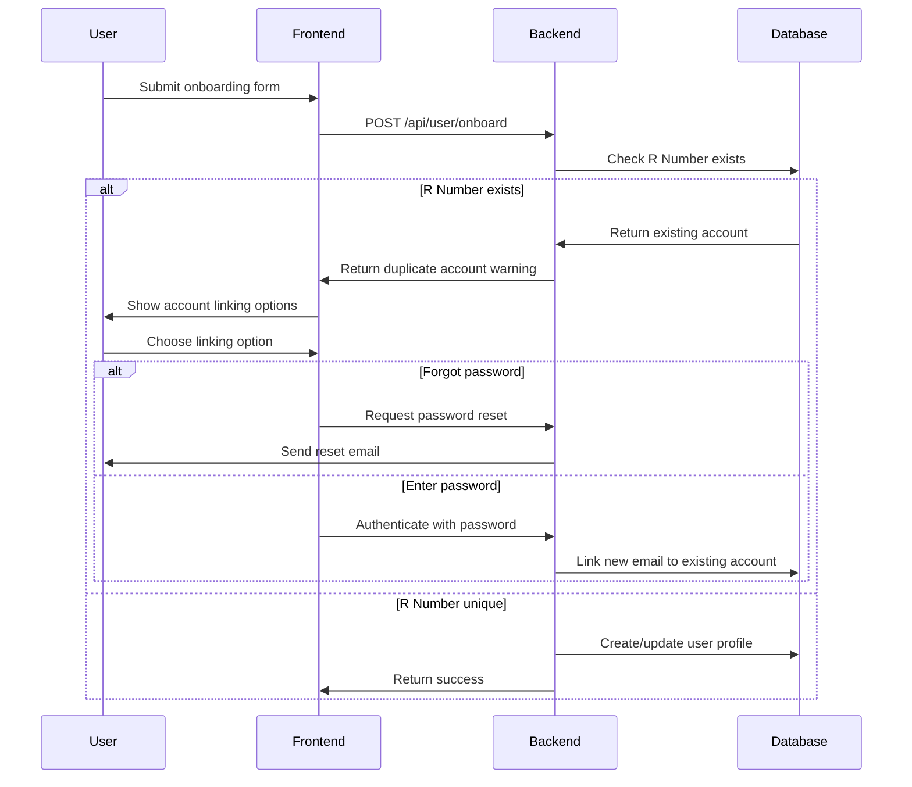

# Design Document: MLH TTU Backend and Onboarding System

## Overview

This design document outlines the architecture and implementation approach for a comprehensive backend and onboarding system for the MLH TTU website. The system provides multi-provider authentication, duplicate account detection, comprehensive user onboarding, and profile management with social media integration and technology skills tracking.

The solution follows a modern full-stack architecture using Node.js/Express/TypeScript for the backend, React/TypeScript/Tailwind for the frontend, PostgreSQL with Prisma ORM for data persistence, and secure file storage for profile pictures and resumes.

## Architecture

### High-Level Architecture



### Authentication Flow



### Duplicate Account Detection Flow



## Components and Interfaces

### Backend Components

#### Authentication Service
```typescript
interface AuthenticationService {
  // OAuth provider configurations
  configureGoogleOAuth(): void;
  configureMicrosoftOAuth(): void;
  configureMagicLink(): void;
  
  // Session management
  createSession(user: User): Promise<SessionToken>;
  validateSession(token: string): Promise<User | null>;
  destroySession(token: string): Promise<void>;
  
  // Route protection
  requireAuth(req: Request, res: Response, next: NextFunction): void;
  redirectBasedOnOnboarding(user: User): string;
}
```

#### Profile Service
```typescript
interface ProfileService {
  // User profile operations
  getUserProfile(userId: string): Promise<UserProfile>;
  updateUserProfile(userId: string, data: ProfileUpdateData): Promise<UserProfile>;
  completeOnboarding(userId: string, data: OnboardingData): Promise<UserProfile>;
  
  // Duplicate detection
  checkRNumberExists(rNumber: string): Promise<User | null>;
  linkAccountByRNumber(rNumber: string, newEmail: string, provider: AuthProvider): Promise<User>;
  
  // Validation
  validateOnboardingData(data: OnboardingData): ValidationResult;
  validateSocialMediaUrls(urls: SocialMediaUrls): ValidationResult;
}
```

#### File Upload Service
```typescript
interface FileUploadService {
  // File upload operations
  uploadProfilePicture(file: Express.Multer.File, userId: string): Promise<FileUploadResult>;
  uploadResume(file: Express.Multer.File, userId: string): Promise<FileUploadResult>;
  
  // File validation
  validateImageFile(file: Express.Multer.File): ValidationResult;
  validateResumeFile(file: Express.Multer.File): ValidationResult;
  
  // File access
  getSecureFileUrl(fileId: string): Promise<string>;
  deleteFile(fileId: string): Promise<void>;
}
```

#### Duplicate Detection Service
```typescript
interface DuplicateDetectionService {
  // Account detection
  findAccountByRNumber(rNumber: string): Promise<User | null>;
  createAccountLinkingToken(existingUserId: string, newEmail: string): Promise<string>;
  
  // Account linking
  processAccountLinking(token: string, password?: string): Promise<AccountLinkResult>;
  sendPasswordResetForLinking(email: string): Promise<void>;
}
```

### Frontend Components

#### Authentication Components
```typescript
interface AuthProviderButtonProps {
  provider: 'google' | 'microsoft' | 'email';
  onAuth: (provider: string) => void;
  disabled?: boolean;
}

interface MagicLinkFormProps {
  onSubmit: (email: string) => void;
  loading?: boolean;
  error?: string;
}
```

#### Onboarding Components
```typescript
interface OnboardingFormProps {
  onSubmit: (data: OnboardingFormData) => void;
  onDuplicateDetected: (existingAccount: User) => void;
  loading?: boolean;
  errors?: ValidationErrors;
}

interface TechnologySelectorProps {
  selectedTechnologies: string[];
  onSelectionChange: (technologies: string[]) => void;
  availableTechnologies: Technology[];
}

interface SocialMediaLinksProps {
  links: SocialMediaUrls;
  onChange: (links: SocialMediaUrls) => void;
  errors?: ValidationErrors;
}

interface FileUploadProps {
  type: 'profile-picture' | 'resume';
  onUpload: (file: File) => void;
  onRemove: () => void;
  currentFile?: string;
  loading?: boolean;
  error?: string;
}
```

#### Account Linking Components
```typescript
interface AccountLinkingModalProps {
  existingAccount: User;
  onLinkAccount: (method: 'password' | 'reset') => void;
  onCancel: () => void;
  loading?: boolean;
}

interface PasswordLinkingFormProps {
  onSubmit: (password: string) => void;
  error?: string;
  loading?: boolean;
}
```

### API Endpoints

#### Authentication Routes
```typescript
// OAuth routes
GET  /auth/google
GET  /auth/google/callback
GET  /auth/microsoft  
GET  /auth/microsoft/callback
POST /auth/magic-link
GET  /auth/magic-link/verify/:token
POST /auth/logout

// Session management
GET  /auth/me
POST /auth/refresh
```

#### User Profile Routes
```typescript
// Profile operations
GET    /api/user/me
PUT    /api/user/profile
POST   /api/user/onboard
DELETE /api/user/account

// Duplicate detection
POST   /api/user/check-duplicate
POST   /api/user/link-account
POST   /api/user/reset-for-linking
```

#### File Upload Routes
```typescript
// File operations
POST   /api/files/profile-picture
POST   /api/files/resume
GET    /api/files/:fileId
DELETE /api/files/:fileId

// File validation
POST   /api/files/validate
```

## Data Models

### User Model
```typescript
interface User {
  id: string;
  email: string;
  provider: AuthProvider;
  hasCompletedOnboarding: boolean;
  
  // Profile information
  firstName?: string;
  lastName?: string;
  major?: string;
  rNumber?: string; // Unique TTU Student ID
  universityLevel?: UniversityLevel;
  aspiredPosition?: string;
  
  // Social media links (optional)
  githubUrl?: string;
  linkedinUrl?: string;
  twitterUrl?: string;
  
  // File references
  profilePictureId?: string;
  resumeId?: string;
  
  // Technology skills
  technologySkills: string[]; // Array of technology IDs
  
  // Timestamps
  createdAt: Date;
  updatedAt: Date;
  lastLoginAt?: Date;
}

enum AuthProvider {
  GOOGLE = 'google',
  MICROSOFT = 'microsoft',
  EMAIL = 'email'
}

enum UniversityLevel {
  FRESHMAN = 'freshman',
  SOPHOMORE = 'sophomore', 
  JUNIOR = 'junior',
  SENIOR = 'senior',
  GRADUATE = 'graduate'
}
```

### Technology Model
```typescript
interface Technology {
  id: string;
  name: string;
  category: TechnologyCategory;
  iconUrl?: string;
  color?: string;
  createdAt: Date;
}

enum TechnologyCategory {
  LANGUAGE = 'language',
  FRAMEWORK = 'framework',
  DATABASE = 'database',
  TOOL = 'tool',
  CLOUD = 'cloud',
  OTHER = 'other'
}
```

### File Model
```typescript
interface File {
  id: string;
  userId: string;
  originalName: string;
  fileName: string; // Unique generated name
  mimeType: string;
  size: number;
  type: FileType;
  storageUrl: string;
  createdAt: Date;
}

enum FileType {
  PROFILE_PICTURE = 'profile_picture',
  RESUME = 'resume'
}
```

### Session Model
```typescript
interface Session {
  id: string;
  userId: string;
  token: string;
  expiresAt: Date;
  createdAt: Date;
  lastAccessedAt: Date;
}
```

### Account Linking Token Model
```typescript
interface AccountLinkingToken {
  id: string;
  existingUserId: string;
  newEmail: string;
  newProvider: AuthProvider;
  token: string;
  expiresAt: Date;
  used: boolean;
  createdAt: Date;
}
```

### Database Schema (Prisma)
```prisma
model User {
  id                      String            @id @default(cuid())
  email                   String            @unique
  provider                AuthProvider
  hasCompletedOnboarding  Boolean           @default(false)
  
  // Profile information
  firstName               String?
  lastName                String?
  major                   String?
  rNumber                 String?           @unique
  universityLevel         UniversityLevel?
  aspiredPosition         String?
  
  // Social media links
  githubUrl               String?
  linkedinUrl             String?
  twitterUrl              String?
  
  // File references
  profilePictureId        String?
  resumeId                String?
  
  // Technology skills (many-to-many)
  technologySkills        UserTechnology[]
  
  // Relations
  sessions                Session[]
  files                   File[]
  linkingTokens           AccountLinkingToken[]
  
  // Timestamps
  createdAt               DateTime          @default(now())
  updatedAt               DateTime          @updatedAt
  lastLoginAt             DateTime?
  
  @@map("users")
}

model Technology {
  id                      String            @id @default(cuid())
  name                    String            @unique
  category                TechnologyCategory
  iconUrl                 String?
  color                   String?
  
  // Relations
  userSkills              UserTechnology[]
  
  createdAt               DateTime          @default(now())
  
  @@map("technologies")
}

model UserTechnology {
  userId                  String
  technologyId            String
  
  user                    User              @relation(fields: [userId], references: [id], onDelete: Cascade)
  technology              Technology        @relation(fields: [technologyId], references: [id], onDelete: Cascade)
  
  @@id([userId, technologyId])
  @@map("user_technologies")
}

model File {
  id                      String            @id @default(cuid())
  userId                  String
  originalName            String
  fileName                String            @unique
  mimeType                String
  size                    Int
  type                    FileType
  storageUrl              String
  
  user                    User              @relation(fields: [userId], references: [id], onDelete: Cascade)
  
  createdAt               DateTime          @default(now())
  
  @@map("files")
}

model Session {
  id                      String            @id @default(cuid())
  userId                  String
  token                   String            @unique
  expiresAt               DateTime
  
  user                    User              @relation(fields: [userId], references: [id], onDelete: Cascade)
  
  createdAt               DateTime          @default(now())
  lastAccessedAt          DateTime          @default(now())
  
  @@map("sessions")
}

model AccountLinkingToken {
  id                      String            @id @default(cuid())
  existingUserId          String
  newEmail                String
  newProvider             AuthProvider
  token                   String            @unique
  expiresAt               DateTime
  used                    Boolean           @default(false)
  
  existingUser            User              @relation(fields: [existingUserId], references: [id], onDelete: Cascade)
  
  createdAt               DateTime          @default(now())
  
  @@map("account_linking_tokens")
}

enum AuthProvider {
  GOOGLE
  MICROSOFT
  EMAIL
}

enum UniversityLevel {
  FRESHMAN
  SOPHOMORE
  JUNIOR
  SENIOR
  GRADUATE
}

enum TechnologyCategory {
  LANGUAGE
  FRAMEWORK
  DATABASE
  TOOL
  CLOUD
  OTHER
}

enum FileType {
  PROFILE_PICTURE
  RESUME
}
```

## Correctness Properties

*A property is a characteristic or behavior that should hold true across all valid executions of a system—essentially, a formal statement about what the system should do. Properties serve as the bridge between human-readable specifications and machine-verifiable correctness guarantees.*

### Property 1: OAuth Authentication Flow Consistency
*For any* OAuth provider (Google or Microsoft), when a user completes the OAuth flow, the system should create a user record with the correct provider type and establish a valid session.
**Validates: Requirements 1.1, 1.2, 1.5, 1.6**

### Property 2: Magic Link Authentication Round Trip
*For any* valid email address, when a magic link is generated and used, the system should authenticate the user and create a secure session equivalent to OAuth authentication.
**Validates: Requirements 1.3, 1.4**

### Property 3: Email Uniqueness Enforcement
*For any* email address, attempting to create multiple user accounts with the same email should fail, regardless of authentication provider.
**Validates: Requirements 2.1, 2.9**

### Property 4: R Number Uniqueness and Duplicate Detection
*For any* R Number, when it already exists in the system, attempting to create a new account with the same R Number should trigger duplicate detection and prevent account creation.
**Validates: Requirements 2.10, 2.11, 5.1**

### Property 5: Onboarding Status-Based Routing
*For any* authenticated user, the redirect destination after authentication should be /onboarding if hasCompletedOnboarding is false, and /profile if hasCompletedOnboarding is true.
**Validates: Requirements 3.1, 3.2**

### Property 6: Route Protection for Unauthenticated Access
*For any* protected route, when accessed by an unauthenticated user, the system should redirect to the login page and maintain the intended destination for post-authentication redirect.
**Validates: Requirements 3.3, 3.4**

### Property 7: Comprehensive Form Validation
*For any* onboarding form submission, all required fields (firstName, lastName, major, rNumber, universityLevel, aspiredPosition) must be present and valid, or the submission should be rejected with specific error messages.
**Validates: Requirements 4.2, 4.3, 4.6, 6.1**

### Property 8: R Number Format Validation
*For any* R Number input, only strings matching the TTU Student ID format should be accepted, and invalid formats should be rejected with descriptive error messages.
**Validates: Requirements 4.4, 6.2**

### Property 9: Social Media URL Validation
*For any* social media URL (GitHub, LinkedIn, X), when provided, it should match the expected URL pattern for that platform, and invalid URLs should be rejected with specific error messages.
**Validates: Requirements 4.7, 4.8, 4.9, 6.3**

### Property 10: Technology Skills Selection Validation
*For any* set of selected technology skills, all selections should exist in the predefined technology list, and invalid selections should be rejected.
**Validates: Requirements 4.10, 6.6**

### Property 11: File Upload Validation and Security
*For any* file upload (profile picture or resume), the file should pass type validation, size validation, and security scanning before being stored with a unique filename and secure URL.
**Validates: Requirements 6.4, 6.5, 8.1, 8.2, 8.3, 8.4, 8.5, 8.6**

### Property 12: Account Linking Flow Integrity
*For any* duplicate R Number scenario, when a user chooses to link accounts, the authentication method (password or reset) should successfully merge the new email/provider with the existing account without data loss.
**Validates: Requirements 5.3, 5.5, 5.6, 5.7**

### Property 13: Complete Profile Data Persistence
*For any* successful onboarding completion, all provided data (required and optional fields, file uploads, technology selections) should be persisted correctly and the hasCompletedOnboarding flag should be set to true.
**Validates: Requirements 2.4, 2.5, 2.6, 2.7, 6.7, 6.8**

### Property 14: API Response Consistency
*For any* API endpoint, valid requests should return success responses with complete data, invalid requests should return appropriate HTTP status codes with structured error messages, and unauthenticated requests to protected endpoints should return 401 Unauthorized.
**Validates: Requirements 7.3, 7.4, 7.5, 7.6, 7.7, 10.4**

### Property 15: Accessibility and Keyboard Navigation
*For any* form element in the onboarding flow, keyboard navigation should work correctly and appropriate ARIA labels should be present for screen reader compatibility.
**Validates: Requirements 9.5, 9.6**

### Property 16: Error Handling and User Feedback
*For any* error condition (authentication failure, validation error, file upload failure), the system should provide clear, user-friendly error messages and appropriate visual feedback.
**Validates: Requirements 10.1, 10.2, 10.3, 10.5, 10.6**

### Property 17: Profile Display Completeness
*For any* user profile, when displayed, all available information (basic info, social links, technology skills, files) should be included in an organized format with proper categorization and secure file access.
**Validates: Requirements 12.1, 12.2, 12.3, 12.4, 12.5, 12.6, 12.7**

## Error Handling

### Authentication Errors
- **OAuth Provider Failures**: Handle OAuth provider downtime or configuration errors gracefully
- **Invalid Magic Links**: Detect expired or tampered magic links and provide clear error messages
- **Session Expiration**: Automatically redirect to login when sessions expire with context preservation

### Validation Errors
- **Form Validation**: Provide field-level validation with real-time feedback
- **File Upload Errors**: Handle file size, type, and security validation failures with specific guidance
- **URL Validation**: Validate social media URLs with platform-specific format checking

### Database Errors
- **Constraint Violations**: Handle unique constraint violations (email, R Number) with user-friendly messages
- **Connection Failures**: Implement retry logic and graceful degradation for database connectivity issues
- **Transaction Failures**: Ensure data consistency with proper transaction rollback

### File Storage Errors
- **Storage Failures**: Handle file storage service outages with retry mechanisms
- **Malicious Content**: Implement virus scanning and malicious content detection
- **File Corruption**: Validate file integrity and handle corruption gracefully

### Network Errors
- **API Timeouts**: Implement proper timeout handling with user feedback
- **Rate Limiting**: Handle rate limits with exponential backoff and user notification
- **Service Unavailability**: Provide fallback mechanisms and status updates

## Testing Strategy

### Dual Testing Approach

The testing strategy employs both unit testing and property-based testing to ensure comprehensive coverage:

**Unit Tests** focus on:
- Specific examples and edge cases
- Integration points between components  
- Error conditions and boundary cases
- API endpoint functionality
- Database operations

**Property Tests** focus on:
- Universal properties that hold for all inputs
- Comprehensive input coverage through randomization
- Validation of correctness properties defined above
- Round-trip operations (serialization, authentication flows)
- Invariant preservation across operations

### Property-Based Testing Configuration

**Framework Selection**: 
- Backend: Use `fast-check` for TypeScript/Node.js property-based testing
- Frontend: Use `fast-check` with React Testing Library for component property testing

**Test Configuration**:
- Minimum 100 iterations per property test to ensure statistical confidence
- Each property test references its corresponding design document property
- Tag format: **Feature: mlh-ttu-backend-onboarding, Property {number}: {property_text}**

**Example Property Test Structure**:
```typescript
// Property 3: Email Uniqueness Enforcement
test('Feature: mlh-ttu-backend-onboarding, Property 3: Email uniqueness enforcement', () => {
  fc.assert(fc.asyncProperty(
    fc.emailAddress(),
    fc.constantFrom('google', 'microsoft', 'email'),
    async (email, provider1) => {
      // Create first user with email and provider1
      const user1 = await createUser({ email, provider: provider1 });
      
      // Attempt to create second user with same email, different provider
      const provider2 = provider1 === 'google' ? 'microsoft' : 'google';
      
      // Should fail due to email uniqueness constraint
      await expect(createUser({ email, provider: provider2 }))
        .rejects.toThrow('Email already exists');
    }
  ), { numRuns: 100 });
});
```

### Unit Testing Balance

Unit tests complement property tests by focusing on:
- **Specific Examples**: Test known good and bad inputs
- **Edge Cases**: Test boundary conditions and special cases
- **Integration Points**: Test component interactions and API integrations
- **Error Scenarios**: Test specific error conditions and recovery

Avoid writing excessive unit tests for scenarios already covered by property tests. Property tests handle comprehensive input coverage, while unit tests should focus on specific, important cases that demonstrate correct behavior.

### Test Categories

**Authentication Tests**:
- OAuth flow integration tests
- Magic link generation and validation
- Session management and expiration
- Route protection middleware

**Data Validation Tests**:
- Form validation with various input combinations
- File upload validation with different file types and sizes
- URL format validation for social media platforms
- R Number format validation

**Database Tests**:
- User model CRUD operations
- Constraint enforcement (uniqueness, foreign keys)
- Transaction integrity and rollback scenarios
- Migration and schema validation

**API Tests**:
- Endpoint functionality and response formats
- Authentication and authorization
- Error handling and status codes
- Request/response payload validation

**File Handling Tests**:
- Secure file upload and storage
- File type and size validation
- Malicious content detection
- Secure URL generation

**Frontend Tests**:
- Component rendering and interaction
- Form submission and validation
- File upload drag-and-drop functionality
- Responsive design behavior (integration tests)

Each test category should include both unit tests for specific scenarios and property tests for comprehensive coverage of the corresponding correctness properties.